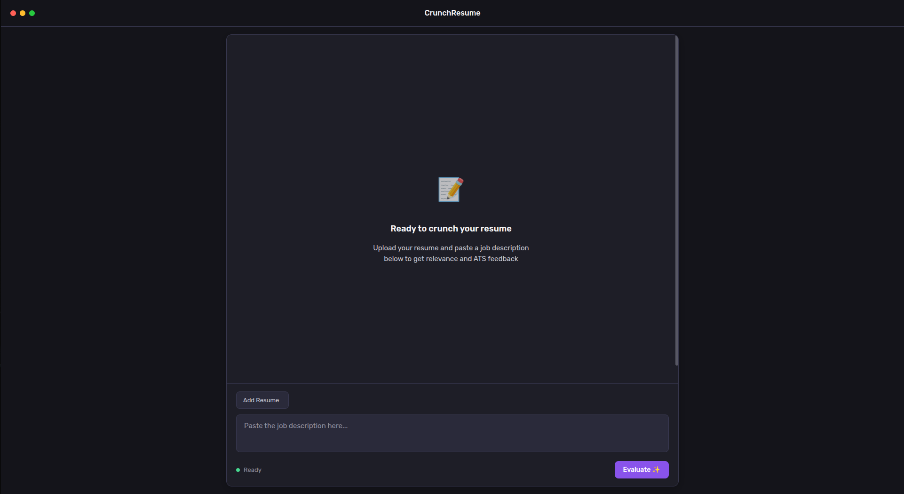
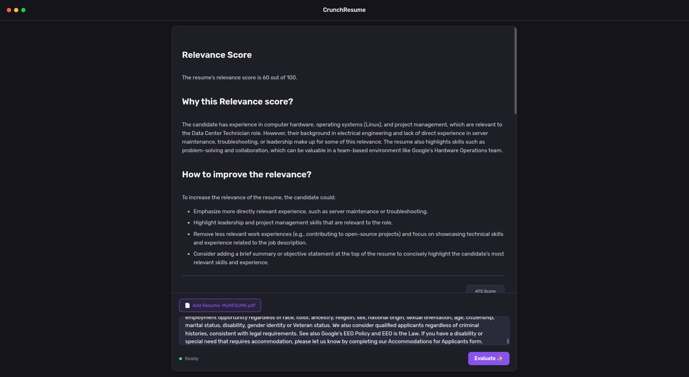
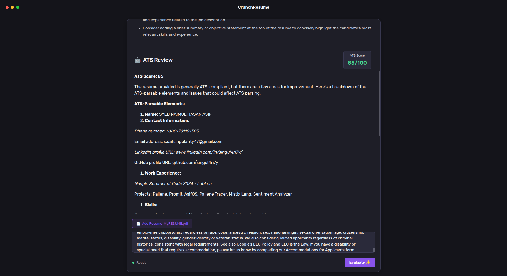

# CrunchResume

CrunchResume allows you to review your resume against job description and gives feedback on relevance and ATS readability using AI!

CrunchResume uses local LLaMA 3.2 inference using Ollama to provide feedback.

## 1. Demonstration

<video src="demo/demo.mp4" type="video/mp4"></video>

## 2. How to use
### Platform support

Currently CrunchResume only supports Linux via `run.sh` script. With that being said, it can also be used on Windows if Ollama server and app is run manually.

### Run

Invoke `run.sh` to run the app. The script will also ensure Ollama server is running and `llama3.2:latest` is installed.

### Get Feedback

Add the resume you want to find relevance against via the **Add Resume** button. Beware, only PDF file format is supported.

Paste the job description you wish to apply for. Click **Evaluate** and let the magic happen.

**_Peace_** 😇.
